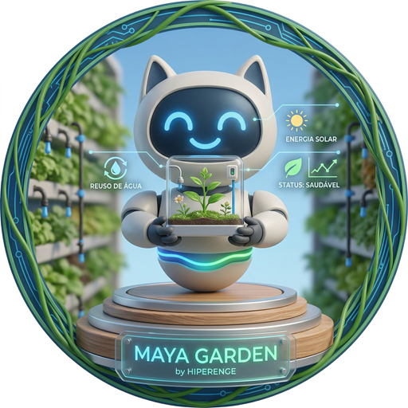

# 🌿 Maya Garden

A integração definitiva para irrigação inteligente no Home Assistant. O **Maya Garden** transforma switches e válvulas comuns em um sistema de jardinagem profissional, automatizado e resiliente.

## ✨ Funcionalidades

- **Configuração Visual**: Nada de YAML. Escolha sua bomba e válvulas direto na interface.
- **Entidades Dinâmicas**: Gera automaticamente seletores de horário, duração e modo para cada zona.
- **Motor de Agendamento Nativo**: Execução precisa direto no backend Python.
- **Inteligência Climática**: Pausa automática em caso de chuva (configurável).
- **Modo Forçado**: Regue mesmo com chuva se necessário.

## 🚀 Instalação via HACS

1. Vá ao **HACS > Integrações**.
2. Clique nos três pontinhos e selecione **Repositórios Personalizados**.
3. Adicione a URL: `https://github.com/klausterra/maya_garden`.
4. Reinicie o Home Assistant e adicione a integração em **Configurações > Dispositivos**.

## 🛠️ Requisitos

- Home Assistant 2023.6 ou superior.
- Válvulas ou Switches já integrados ao HA.
- (Opcional) Sensor de chuva binário.

---
*Developed by HIPERENGE*
